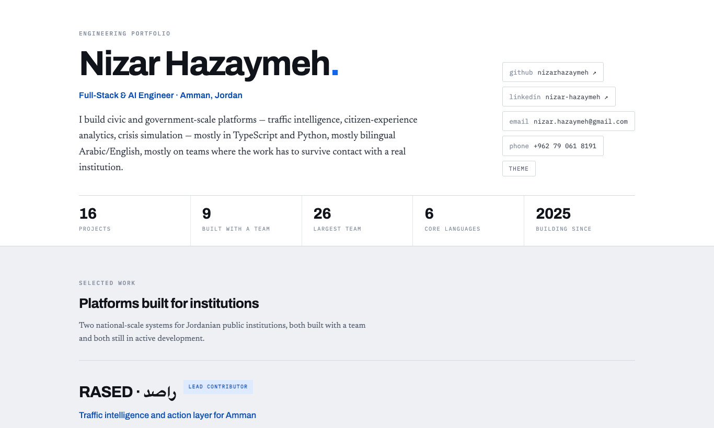
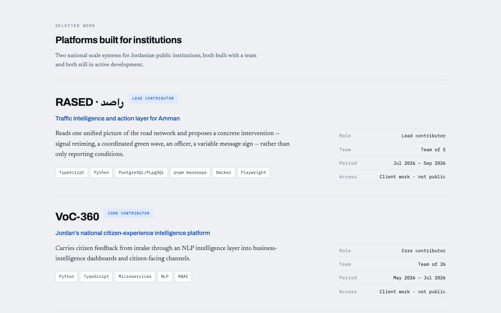
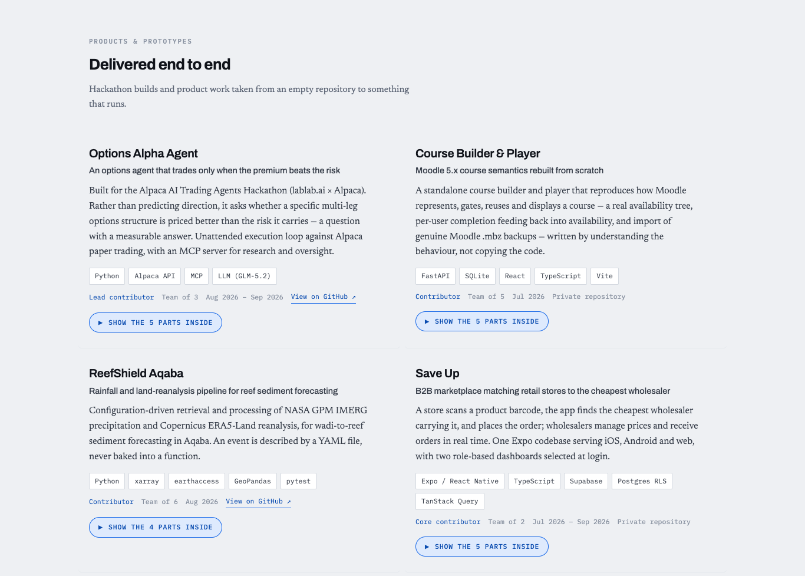
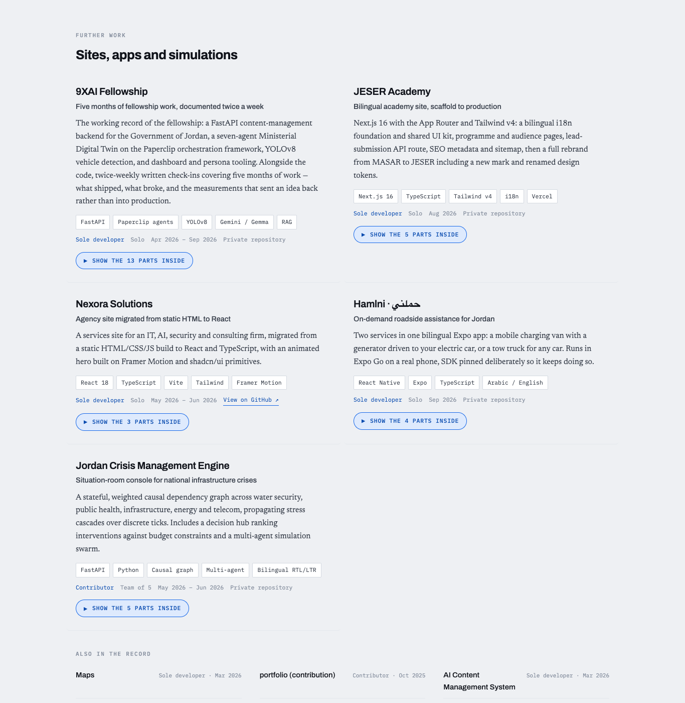
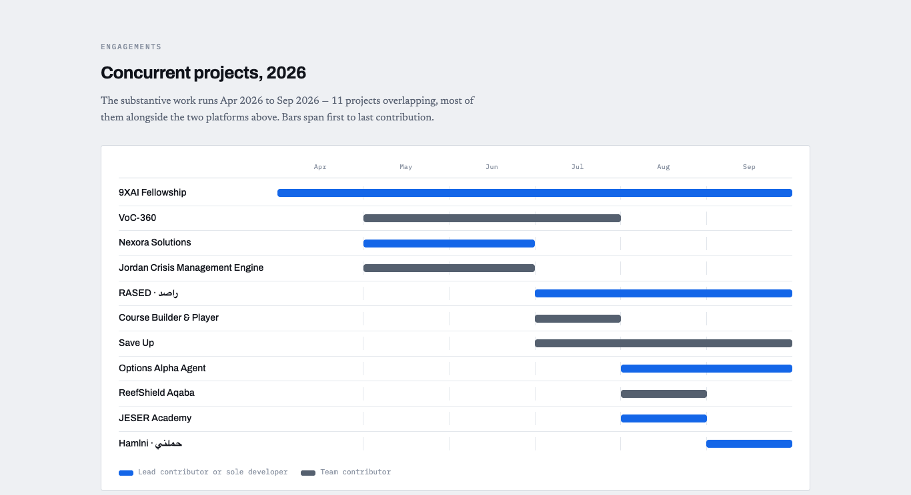
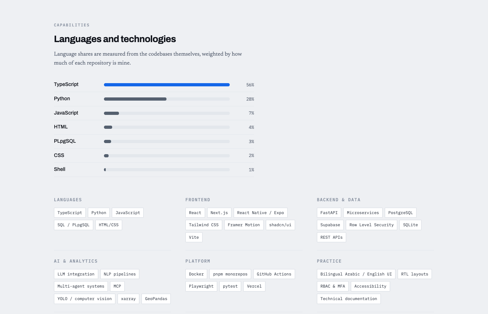
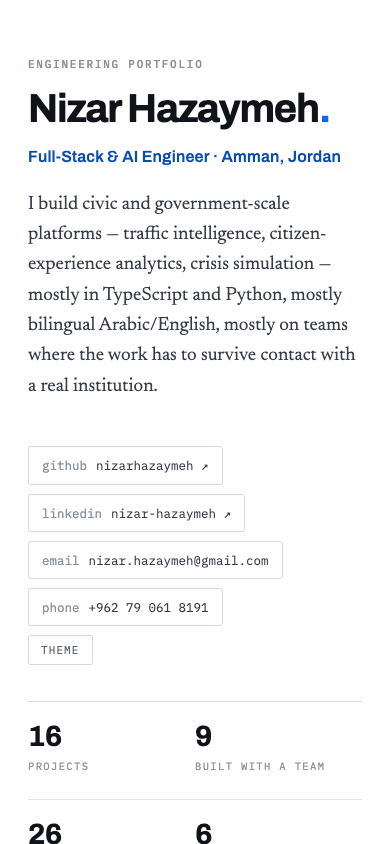

# Task 1 — Personal Portfolio Website

**Auspify Full Stack Development Internship · Task 1 (Easy)**

My personal portfolio, deployed on GitHub Pages.

| | |
|---|---|
| 🌐 **Live site** | **https://nizarhazaymeh.github.io/** |
| 💻 **Source code** | https://github.com/nizarhazaymeh/nizarhazaymeh.github.io |
| 🚀 **Hosting** | GitHub Pages |

## What it shows
- **Home / introduction:** name, role (Full-Stack & AI Engineer, Amman, Jordan), a short bio, and headline stats (16 projects, 9 built with a team, largest team of 26, 6 core languages).
- **Projects showcase**, in three sections:
  - *Selected work:* national-scale platforms for Jordanian public institutions (RASED traffic intelligence, VoC-360 citizen-experience platform), with role, team size, period and access for each.
  - *Delivered end to end:* shipped projects.
  - *Sites, apps and simulations:* further projects with tech-stack tags, roles, dates, GitHub links where public, and expandable "parts inside" breakdowns, plus an "also in the record" list.
- **Timeline:** concurrent projects in 2026.
- **Skills:** languages and technologies.
- **Contact:** GitHub, LinkedIn, email and phone links in the header.

## Requirements checklist
| Task 1 requirement | How it's met |
|---|---|
| Design the website layout | Single-page layout with a hero, stats strip and themed sections |
| Home, About, Projects and Contact content | Introduction and bio (home/about), three project sections, skills and timeline, contact links |
| Responsive design | Adapts from desktop to phone with no sideways scrolling (verified at 1366 px and 390 px) |
| Project showcase | 16 projects with descriptions, tech tags, roles, dates, and GitHub links where the code is public |
| Deployment | Live on GitHub Pages |
| Professional UI | Clean typographic design, bilingual Arabic/English project names, light/dark theme toggle |

## Tech
HTML, CSS and JavaScript (no framework). The project content is generated from my Git history.

## Screenshots

### Home

### Selected work

### Delivered end to end

### Sites, apps and simulations

### Timeline

### Skills

### Mobile

